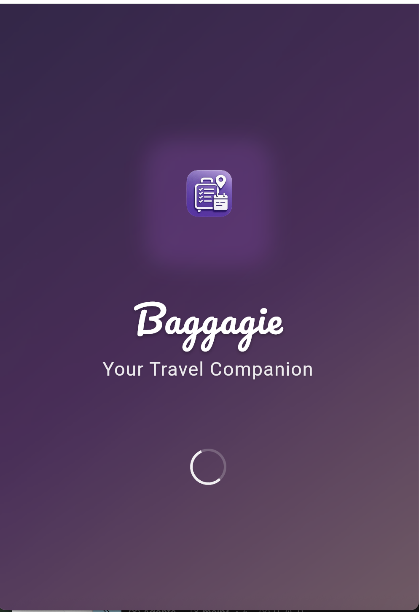
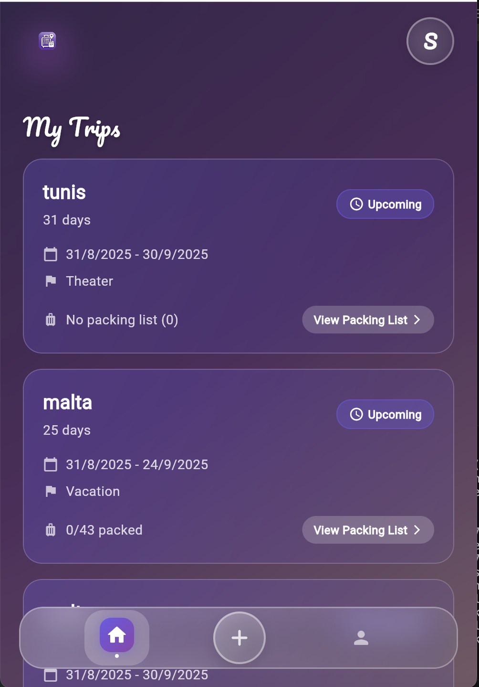
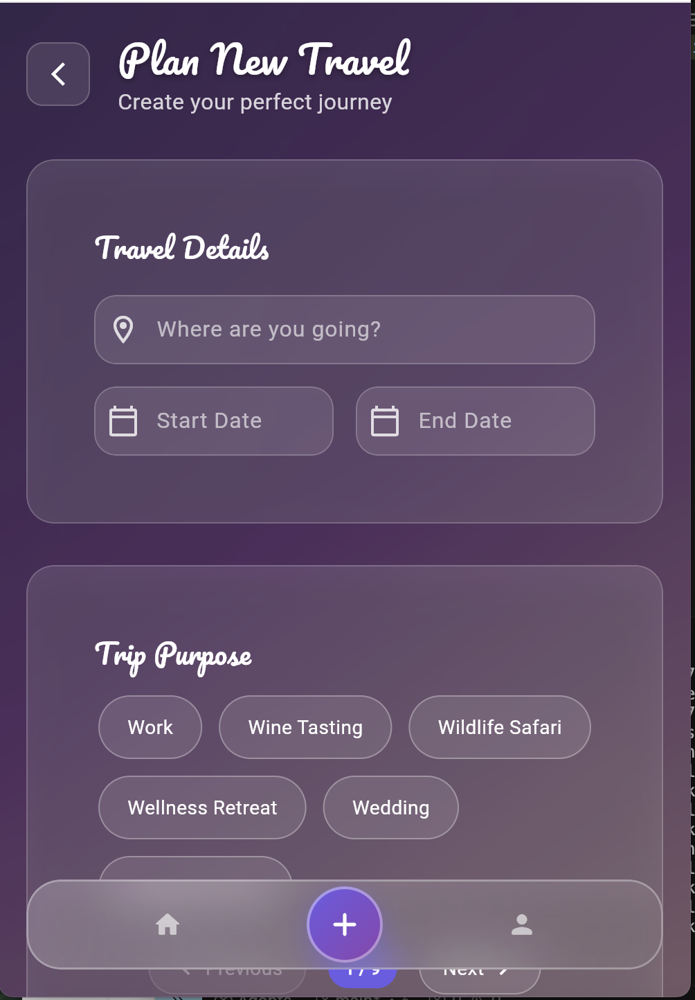
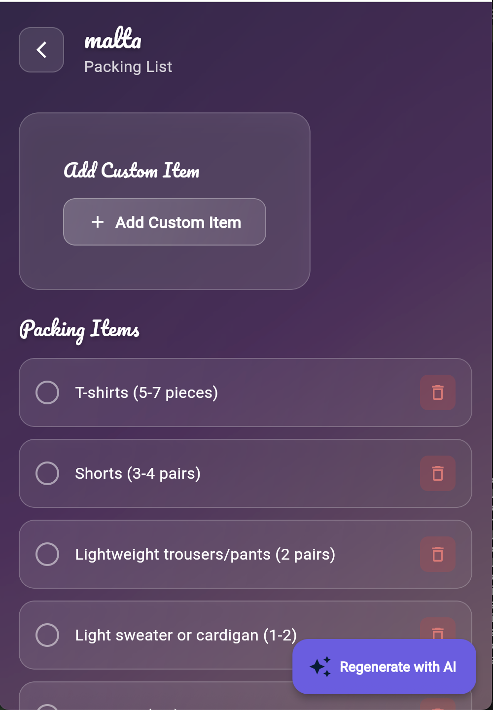
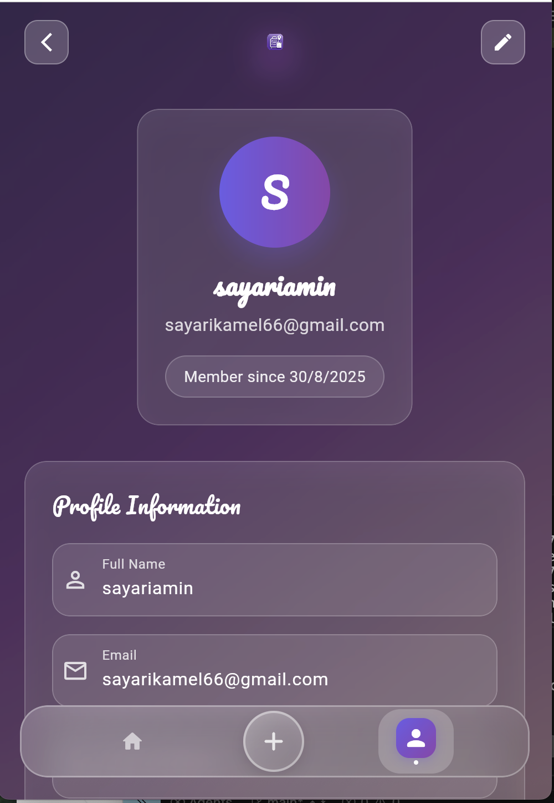
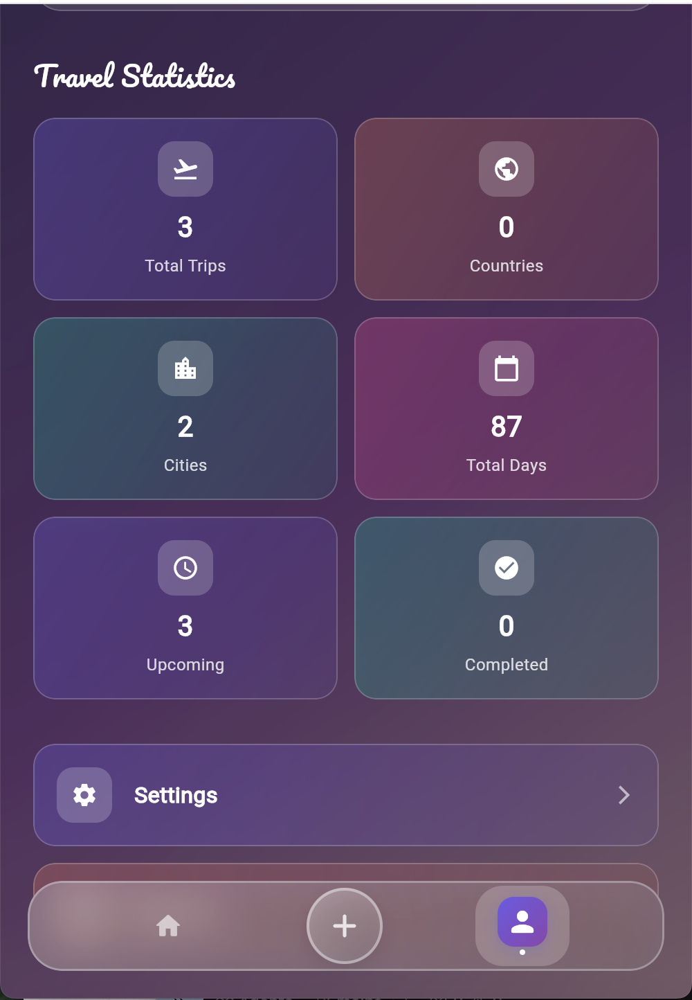

<div align="center">

# 🧳 Baggagie
### *Smart Travel Packing Assistant Powered by AI*

[](https://flutter.dev/)
[](https://dart.dev/)
[](https://supabase.com/)
[](https://ai.google.dev/)

*Never forget your essentials again! 🎯*

[📱 **Features**](#-features) • [🏗️ **Architecture**](#️-architecture) • [⚡ **Quick Start**](#-quick-start) • [🤝 **Contributing**](#-contributing)

---

## 📸 Screenshots

<div align="center">

### 🚀 Splash Screen


### 🏠 Home & Trip List


### ✈️ New Trip Creation


### 📦 AI-Powered Packing List


### 👤 User Profile & Statistics


### 📊 Travel Statistics


</div>

---

</div>

## 🌟 Overview

**Baggagie** is a revolutionary Flutter application that transforms the way you pack for travel. By leveraging the power of **Google's Gemini 1.5 Flash AI**, it automatically generates personalized packing lists based on your destination, trip duration, activities, and purpose. Say goodbye to forgotten essentials and hello to stress-free travel! ✈️

### 🎯 Why Baggagie?

- 🤖 **AI-Powered Intelligence**: Smart packing suggestions tailored to your specific trip
- 🎨 **Beautiful UI**: Modern glassmorphism design with smooth animations
- 🔐 **Secure Authentication**: Built with Supabase for enterprise-grade security
- 📱 **Cross-Platform**: Works seamlessly on iOS, Android, and Web
- 🏗️ **Clean Architecture**: Maintainable, scalable, and testable codebase
- ⚡ **Real-time Updates**: Live synchronization across all your devices

---

## ✨ Features

### 🧠 AI-Powered Packing Lists
- **Smart Generation**: AI analyzes your trip details and creates comprehensive packing lists
- **Context-Aware**: Considers destination, season, duration, and activities
- **Fallback System**: Always provides essential items even if AI is unavailable
- **Regeneration**: Easily regenerate lists with updated preferences

### 🎨 Stunning User Interface
- **Glassmorphism Design**: Modern, translucent UI elements with blur effects
- **Smooth Animations**: Fluid transitions and micro-interactions
- **Responsive Layout**: Optimized for all screen sizes
- **Dark/Light Theme**: Adaptive theming system

### 🔐 Robust Authentication
- **Email/Password**: Secure authentication with Supabase
- **Session Management**: Persistent login across app restarts
- **User Profiles**: Personalized experience with user data
- **Password Reset**: Seamless password recovery flow

### 📊 Travel Management
- **Trip Creation**: Easy trip planning with date selection
- **Activity Planning**: Choose from various travel activities
- **Purpose Selection**: Business, vacation, adventure, and more
- **Progress Tracking**: Visual progress indicators for packing completion

### 📱 Cross-Platform Support
- **iOS**: Native iOS experience with Cupertino design elements
- **Android**: Material Design 3 with adaptive theming
- **Web**: Progressive Web App with offline capabilities

---

## 🏗️ Architecture

Baggagie follows **Clean Architecture** principles with a well-structured MVC pattern:

```
lib/
├── 🎨 views/           # UI Components & Screens
│   ├── home/           # Dashboard & trip overview
│   ├── new_travel/     # Trip creation wizard
│   ├── packing_list/   # Packing list management
│   ├── profile/        # User profile & settings
│   └── signup-signin/  # Authentication screens
├── 🎮 controllers/     # Business Logic & State Management
│   ├── auth_controller.dart
│   ├── travel_controller.dart
│   └── packing_controller.dart
├── 🗄️ models/         # Data Models & Business Entities
│   ├── user.dart
│   ├── travel.dart
│   ├── packing_list.dart
│   └── packing_item.dart
├── 🔧 services/       # External Services & API Integration
│   ├── auth_service.dart
│   ├── travel_service.dart
│   ├── packing_service.dart
│   └── gemini_service.dart
├── 🧩 widgets/        # Reusable UI Components
│   ├── glassmorphism_card.dart
│   ├── custom_button.dart
│   └── app_logo.dart
└── ⚙️ utils/          # Utilities & Constants
    └── constants.dart
```

### 🏛️ Architecture Principles

- **Separation of Concerns**: Clear boundaries between UI, business logic, and data
- **Dependency Inversion**: High-level modules don't depend on low-level modules
- **Single Responsibility**: Each class has one reason to change
- **Open/Closed**: Open for extension, closed for modification

---

## ⚡ Quick Start

### 📋 Prerequisites

- **Flutter SDK** (3.8.1 or higher)
- **Dart SDK** (3.0.0 or higher)
- **Supabase Account** (for backend services)
- **Google AI API Key** (for Gemini integration)

### 🛠️ Installation

1. **Clone the repository**
   ```bash
   git clone https://github.com/kaaboura12/baggagie-v0.1.git
   cd baggagie-v0.1
   ```

2. **Install dependencies**
   ```bash
   flutter pub get
   ```

3. **Set up environment variables**
   ```bash
   # Create .env file in lib/public/assets/
   cp lib/public/assets/.env.template lib/public/assets/.env
   
   # Edit .env with your credentials
   nano lib/public/assets/.env
   ```

4. **Configure Supabase**
   ```env
   SUPABASE_URL=your_supabase_project_url
   SUPABASE_ANON_KEY=your_supabase_anon_key
   GEMINI_API_KEY=your_gemini_api_key
   ```

5. **Run the application**
   ```bash
   # For development
   flutter run
   
   # For web
   flutter run -d chrome
   
   # For production build
   flutter build web --release
   ```

### 🗄️ Database Setup

Run these SQL commands in your Supabase SQL editor:

```sql
-- Users table (handled by Supabase Auth)
-- Travels table
CREATE TABLE travels (
  id UUID PRIMARY KEY DEFAULT gen_random_uuid(),
  user_id UUID REFERENCES auth.users(id) ON DELETE CASCADE,
  destination TEXT NOT NULL,
  start_date DATE NOT NULL,
  end_date DATE NOT NULL,
  duration_days INTEGER GENERATED ALWAYS AS (end_date - start_date + 1) STORED,
  purpose_id TEXT,
  created_at TIMESTAMP WITH TIME ZONE DEFAULT NOW(),
  updated_at TIMESTAMP WITH TIME ZONE DEFAULT NOW()
);

-- Packing lists table
CREATE TABLE packing_lists (
  id UUID PRIMARY KEY DEFAULT gen_random_uuid(),
  travel_id UUID REFERENCES travels(id) ON DELETE CASCADE,
  name TEXT NOT NULL,
  created_at TIMESTAMP WITH TIME ZONE DEFAULT NOW()
);

-- Packing items table
CREATE TABLE packing_items (
  id UUID PRIMARY KEY DEFAULT gen_random_uuid(),
  packing_list_id UUID REFERENCES packing_lists(id) ON DELETE CASCADE,
  name TEXT NOT NULL,
  is_packed BOOLEAN DEFAULT FALSE,
  created_at TIMESTAMP WITH TIME ZONE DEFAULT NOW()
);
```

---

## 🎮 Usage

### 🆕 Creating Your First Trip

1. **Sign up** for a new account or **sign in** to existing account
2. **Tap the "+" button** to create a new trip
3. **Fill in trip details**:
   - Destination (e.g., "Paris, France")
   - Start and end dates
   - Trip purpose (Business, Vacation, Adventure, etc.)
   - Planned activities
4. **Let AI work its magic** - your personalized packing list will be generated automatically!

### 📦 Managing Your Packing List

- ✅ **Check off items** as you pack them
- 🔄 **Regenerate list** if you need different suggestions
- ➕ **Add custom items** to your list
- 📊 **Track progress** with the completion percentage

### 👤 Profile Management

- 📊 **View travel statistics** and packing history
- ⚙️ **Update profile information**
- 🔐 **Manage account settings**

---

## 🧪 Testing

```bash
# Run all tests
flutter test

# Run specific test files
flutter test test/gemini_service_test.dart
flutter test test/packing_list_test.dart

# Run with coverage
flutter test --coverage
```

### 📊 Test Coverage

- ✅ **Unit Tests**: Models, services, and controllers
- ✅ **Widget Tests**: UI components and user interactions
- ✅ **Integration Tests**: End-to-end user flows
- ✅ **Error Handling**: API failures and edge cases

---

## 🛠️ Development

### 🔧 Available Scripts

```bash
# Development
flutter run                    # Run in debug mode
flutter run -d chrome         # Run on web

# Testing
flutter test                  # Run tests
flutter analyze               # Static analysis

# Code Quality
dart format .                 # Format code
dart fix --apply              # Apply fixes
```

### 🏗️ Project Structure

```
baggagie/
├── 📱 android/              # Android-specific files
├── 🍎 ios/                  # iOS-specific files
├── 🌐 web/                  # Web-specific files
├── 🐧 linux/                # Linux-specific files
├── 🪟 windows/              # Windows-specific files
├── 🍎 macos/                # macOS-specific files
├── 📚 lib/                  # Main application code
├── 🧪 test/                 # Test files
├── 📄 pubspec.yaml          # Dependencies and metadata
└── 📖 README.md             # This file
```

---

## 🤝 Contributing

We welcome contributions! Here's how you can help:

### 🐛 Bug Reports
- Use the [GitHub Issues](https://github.com/kaaboura12/baggagie-v0.1/issues) page
- Include steps to reproduce the bug
- Provide device/OS information

### 💡 Feature Requests
- Open a new issue with the "enhancement" label
- Describe the feature and its benefits
- Consider implementation complexity

### 🔧 Pull Requests
1. **Fork** the repository
2. **Create** a feature branch (`git checkout -b feature/amazing-feature`)
3. **Commit** your changes (`git commit -m 'Add amazing feature'`)
4. **Push** to the branch (`git push origin feature/amazing-feature`)
5. **Open** a Pull Request

### 📋 Development Guidelines

- Follow [Dart Style Guide](https://dart.dev/guides/language/effective-dart/style)
- Write tests for new features
- Update documentation as needed
- Use conventional commit messages

---

## 📄 License

This project is licensed under the **MIT License** - see the [LICENSE](LICENSE) file for details.

---

## 🙏 Acknowledgments

- **Flutter Team** - For the amazing framework
- **Supabase** - For the backend infrastructure
- **Google AI** - For the Gemini API
- **Contributors** - For their valuable contributions

---

## 📞 Support

- 📧 **Email**: [your-email@example.com](mailto:your-email@example.com)
- 🐛 **Issues**: [GitHub Issues](https://github.com/kaaboura12/baggagie-v0.1/issues)
- 💬 **Discussions**: [GitHub Discussions](https://github.com/kaaboura12/baggagie-v0.1/discussions)

---

<div align="center">

### ⭐ Star this repository if you found it helpful!

**Made with ❤️ and Flutter**

[](https://github.com/kaaboura12/baggagie-v0.1/stargazers)
[](https://github.com/kaaboura12/baggagie-v0.1/network)
[](https://github.com/kaaboura12/baggagie-v0.1/watchers)

</div>