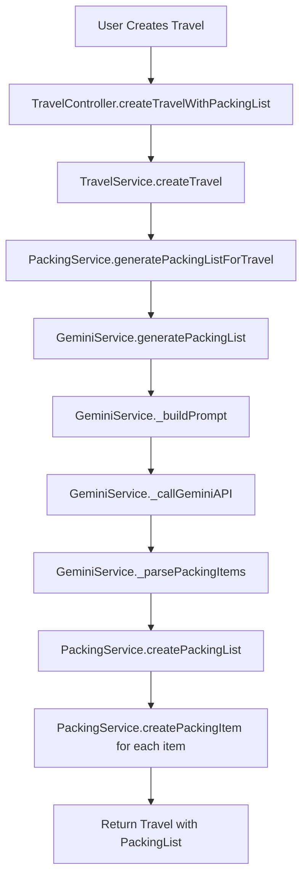

# AI-Powered Packing List Generation

This document explains how the AI-powered packing list generation feature works in the Baggagie app.

## Overview

When a user creates a new travel, the app automatically generates a personalized packing list using Google's Gemini 1.5 Flash AI model. The AI analyzes the travel details and creates a comprehensive list of items needed for the trip.

## Architecture

The implementation follows clean architecture principles with the following components:

### 1. GeminiService (`lib/services/gemini_service.dart`)
- **Purpose**: Handles communication with Google's Gemini 1.5 Flash API
- **Key Methods**:
  - `initialize()`: Sets up the API key from environment variables
  - `generatePackingList(Travel travel)`: Main method that generates packing items for a travel
  - `_buildPrompt(Travel travel)`: Creates a detailed prompt for the AI
  - `_callGeminiAPI(String prompt)`: Makes HTTP request to Gemini API
  - `_parsePackingItems(String response, String travelId)`: Parses AI response into PackingItem objects
  - `_getDefaultPackingItems(String travelId)`: Fallback items if AI fails

### 2. PackingService (`lib/services/packing_service.dart`)
- **Purpose**: Handles database operations for packing lists and items
- **Key Methods**:
  - `generatePackingListForTravel(Travel travel)`: Orchestrates AI generation and database storage
  - `createPackingList()`: Creates a new packing list in the database
  - `createPackingItem()`: Creates individual packing items
  - `getPackingListsForTravel()`: Retrieves all packing lists for a travel
  - `updatePackingItemStatus()`: Updates item's packed status
  - `regeneratePackingList()`: Regenerates packing list using AI

### 3. PackingController (`lib/controllers/packing_controller.dart`)
- **Purpose**: Manages state and business logic for packing lists
- **Key Features**:
  - State management using ChangeNotifier
  - Error handling and loading states
  - Local state synchronization with database
  - CRUD operations for packing items

### 4. TravelController (`lib/controllers/travel_controller.dart`)
- **Purpose**: Manages travel creation with integrated packing list generation
- **Key Methods**:
  - `createTravelWithPackingList()`: Creates travel and generates packing list
  - `createTravel()`: Creates travel without packing list (backward compatibility)

## How It Works

### 1. Travel Creation Flow



### 2. AI Prompt Generation

The AI prompt includes:
- **Destination**: Where the user is traveling
- **Duration**: Number of days
- **Dates**: Start and end dates for seasonal considerations
- **Trip Purpose**: Business, vacation, adventure, etc.
- **Activities**: Specific activities planned (sightseeing, hiking, dining, etc.)

Example prompt:
```
You are a travel packing expert. Based on the following trip details, generate a comprehensive and practical packing list.

Trip Details:
- Destination: Paris, France
- Duration: 7 days
- Start Date: 2024-06-01
- End Date: 2024-06-08
- Trip Purpose: Vacation
- Planned Activities: Sightseeing, Fine Dining, Museum Visits

Please provide a JSON response with an array of packing items...
```

### 3. AI Response Processing

The AI returns a JSON array of items with:
- `name`: Specific item name (e.g., "T-shirts (3-4 pieces)", "Universal adapter")
- `category`: Item category (clothing, toiletries, electronics, etc.)

The response is parsed and converted into `PackingItem` objects with:
- Temporary IDs (replaced by database)
- Default `isPacked: false` status
- Current timestamp for `createdAt`

### 4. Error Handling

The system includes robust error handling:
- **API Failures**: Falls back to default packing items
- **Parsing Errors**: Uses default items if JSON parsing fails
- **Network Issues**: Graceful degradation with user notification
- **Missing API Key**: Warning logged, app continues without AI features

## Configuration

### Environment Variables

Add to your `.env` file:
```env
GEMINI_API_KEY=your_gemini_api_key_here
```

### API Setup

1. Go to [Google AI Studio](https://makersuite.google.com/app/apikey)
2. Create a new API key
3. Add it to your `.env` file
4. The app will automatically initialize the service on startup

## Database Schema

### Packing Lists Table
```sql
CREATE TABLE packing_lists (
  id UUID PRIMARY KEY DEFAULT gen_random_uuid(),
  travel_id UUID REFERENCES travels(id) ON DELETE CASCADE,
  name TEXT NOT NULL,
  created_at TIMESTAMP WITH TIME ZONE DEFAULT NOW()
);
```

### Packing Items Table
```sql
CREATE TABLE packing_items (
  id UUID PRIMARY KEY DEFAULT gen_random_uuid(),
  packing_list_id UUID REFERENCES packing_lists(id) ON DELETE CASCADE,
  name TEXT NOT NULL,
  is_packed BOOLEAN DEFAULT FALSE,
  created_at TIMESTAMP WITH TIME ZONE DEFAULT NOW()
);
```

## Usage Examples

### Creating a Travel with AI Packing List

```dart
final travelController = Provider.of<TravelController>(context, listen: false);

final travel = await travelController.createTravelWithPackingList(
  userId: user.id,
  destination: 'Tokyo, Japan',
  startDate: DateTime(2024, 6, 1),
  endDate: DateTime(2024, 6, 8),
  purposeId: 'business',
  activityIds: ['meetings', 'networking'],
);

// The travel will now have a packing list with AI-generated items
print('Generated ${travel.packingLists.first.items.length} packing items');
```

### Regenerating a Packing List

```dart
final packingController = Provider.of<PackingController>(context, listen: false);

await packingController.regeneratePackingList(
  existingPackingList,
  travel,
);
```

## Performance Considerations

- **API Rate Limits**: Gemini API has rate limits; consider caching for frequent requests
- **Response Time**: AI generation takes 2-5 seconds; show loading indicators
- **Fallback Strategy**: Always provide default items if AI fails
- **Offline Support**: App works without AI features if API is unavailable

## Future Enhancements

1. **Caching**: Cache AI responses for similar trips
2. **User Preferences**: Learn from user's packing habits
3. **Weather Integration**: Include weather data in AI prompts
4. **Category Organization**: Group items by categories in UI
5. **Smart Suggestions**: Suggest items based on destination and season
6. **Collaborative Lists**: Share packing lists with travel companions

## Testing

The implementation includes:
- Unit tests for model validation
- Integration tests for service methods
- Error handling tests for API failures
- UI tests for the complete flow

Run tests with:
```bash
flutter test
```

## Troubleshooting

### Common Issues

1. **"GEMINI_API_KEY not found"**
   - Ensure `.env` file exists and contains the API key
   - Check that the key is properly formatted

2. **"Failed to generate packing list"**
   - Check internet connection
   - Verify API key is valid and has quota
   - Check API rate limits

3. **"Invalid response format from Gemini API"**
   - AI response parsing failed
   - App will fall back to default items
   - Check API response format

### Debug Mode

Enable debug logging by setting:
```dart
print('Gemini API Response: $response');
```

This will help diagnose API communication issues.
